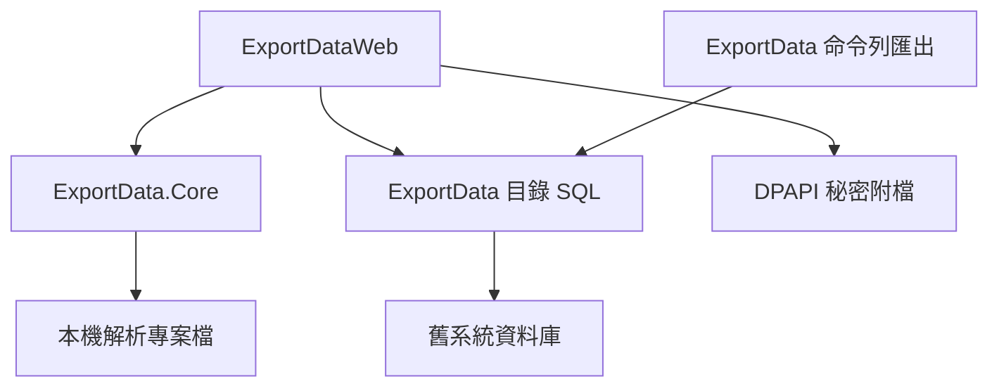
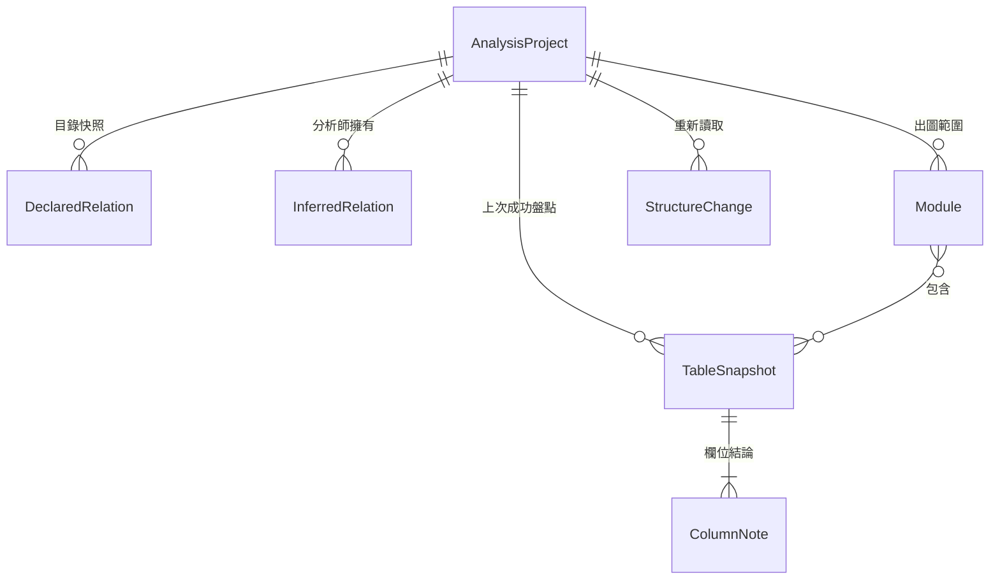

# Architecture Spine — ExportDataProject

## Design Paradigm

Ports and adapters。`ExportData.Core` 擁有解析專案，並定義連接埠。`ExportDataWeb` 是唯一的驅動轉接器，同時實作目錄讀取與秘密庫。`ExportData` 的四種 `ISqlGenerater` 只產生目錄 SQL。命令列只做既有的大量 CSV 匯出，不引用核心。

## Invariants & Rules



### AD-1 — 核心定義連接埠 [ADOPTED]

- **Binds:** 全部功能
- **Prevents:** 頁面、命令列與各資料庫產生器各自擁有確認狀態或圖模型
- **Rule:** `ExportData.Core` 是獨立專案。它定義五個連接埠：目錄讀取、解析專案儲存、秘密庫、分析包寫出、用途起草。核心實作確認狀態、基數、遮罩、投影、分析包組裝，以及解析專案的檔案儲存。核心不引用 ASP.NET Core、Dapper、資料庫驅動或 DPAPI。目錄讀取與秘密庫由 `ExportDataWeb` 實作。目錄讀取只使用結構、關聯、資料庫資訊，以及有上限的範例查詢；不轉呼叫 `GetSqlRecords`，也不讀取 `SqlAllTable` 或 `SqlOneTable`。`ExportData` 命令列專案不引用 `ExportData.Core`。

### AD-2 — 解析專案是唯一結論紀錄 [ADOPTED]

- **Binds:** FR-1、FR-2、FR-4、FR-8、FR-14
- **Prevents:** 工作台讀即時目錄、匯出讀另一份快照，兩邊表列不一致
- **Rule:** 分析師的用途、依據、確認狀態、已接受或拒絕的推測關聯、模組，只存在解析專案文件。目錄連接埠只讀舊系統資料庫。打開專案時顯示上次成功盤點的快照。重新讀取成功後才整份換上新快照。連線失敗保留原快照，清單不得顯示成零張表。約略筆數寫在盤點快照裡。打開專案不重查筆數。單一資料表筆數失敗時，該列為未知，其他表仍留在快照。宣告關聯數把作為父表與作為子表都計入。宣告關聯一列是一對父欄與子欄；複合外鍵是多列，共用約束名稱，基數按每一列的子欄計算。重新讀取先在記憶體組好整份新快照，依 AD-9 合併結論後一次寫入。中途失敗則磁碟上的檔案保持原樣。文件格式是一份 JSON，寫入方式是暫存檔再改名。

### AD-3 — 確認狀態只有核心命令推得動 [ADOPTED]

- **Binds:** FR-8、FR-9、FR-10、FR-17
- **Prevents:** 起草、重新讀取或頁面直接把欄位標成已確認
- **Rule:** 欄位確認狀態的寫入只經過核心命令：寫入用途、起草成功、確認、略過、改寫已確認文字、清除略過。允許的轉換以 PRD FR-9 為準。確認命令拒絕空白用途，也拒絕檢視表。資料表確認狀態由核心依欄位彙總，頁面只顯示該結果。頁面在打開另一張表之前，先呼叫寫入用途。起草連接埠回傳用途與依據，沒有確認狀態參數。它不覆蓋已確認或略過，除非命令明示重新起草已確認欄位。找不到可引用觀察時不寫用途，依據為「證據不足」，狀態維持未看。依據引用範例時只寫形狀，不寫原始儲存格。分析師寫下的用途原樣保存。失敗不清除既有用途與確認狀態。用途為單段，全數保存，匯出不截斷。

### AD-4 — 圖、字典與未確認清單是同一快照的投影 [ADOPTED]

- **Binds:** FR-11、FR-12、FR-13、FR-16、FR-20、FR-21、FR-22
- **Prevents:** 鄰居圖、模組圖、UML、字典各算各的基數，或未明被畫成星號
- **Rule:** 投影只讀解析專案裡的快照。可畫的關係只有宣告關聯與已接受的推測關聯。基數由核心一個函式計算，父端為 `1`，無法依 FR-12 判定時為未明。UML 多重性抄該結果。渲染器不得把未明畫成多對多或 `*` 對 `*`。鄰居圖深度一層。模組圖只含模組內的表；另一端在模組外則不畫，並在圖旁列出。實體關係圖只用 crow's foot。草稿用途不上圖。宣告關聯與已接受的推測關聯用兩種線，圖例用 AD-10 的詞。繪圖呼叫可帶入工作階段座標，沒有座標則自動佈局，座標不寫回文件。匯出使用同一次呼叫。

### AD-5 — 目錄連接埠只做有上限的讀取 [ADOPTED]

- **Binds:** FR-1、FR-7、唯讀與逾時
- **Prevents:** 工作台接受任意 SQL，或範例列數沿用匯出的 Size
- **Rule:** 目錄連接埠沒有寫入方法，也不接受呼叫端傳入的 SQL。識別字由該轉接器加引號。表名與前綴比較只使用連線成功時寫入解析專案的識別字規則，頁面不得另選。SQLite 為不分大小寫。SQL Server 讀取資料庫定序，讀不到則不分大小寫。MySQL 讀取 `lower_case_table_names`，值為 0 則區分大小寫，其餘不分大小寫。Oracle 未加引號的識別字以大寫比較。範例查詢在資料庫端截斷，預設 20 列、上限 100 列、逾時 30 秒。快照含型別、長度或精度、可否空值、主鍵、外鍵、參照、預設值與唯一索引。基數函式只讀這份快照，不掃描資料列。範例次序：有主鍵則主鍵升冪，否則依目錄回傳的穩定次序。超過上限則拒絕。空表不捏造範例。結構、範例、鄰居圖任一塊失敗時，另外的塊仍可用並說明原因。既有 `SqlAllTable`、`SqlOneTable` 與匯出 Size 只留在命令列大量匯出。

### AD-6 — 秘密與儲存格不進入可匯出的模型 [ADOPTED]

- **Binds:** 機密、FR-18、FR-23
- **Prevents:** 整份專案被序列化進分析包，或遮罩規則在匯出與起草各寫一份
- **Rule:** 解析專案文件沒有連線字串、密碼或儲存格。秘密庫連接埠由 `ExportDataWeb` 實作，儲存體是專案檔旁邊的 Windows DPAPI 附檔。建立專案時，頁面把連線字串交給秘密庫後即不再放進回應或文件。工作台的原始範例只存在該次目錄讀取的回應。分析包的輸入型別沒有連線字串。預設組裝只接收遮罩結果。遮罩規則以 FR-23 為準，不另做第二套。該次匯出可開啟「包含未遮罩範例」，預設關閉；開啟時封面印「本包含未遮罩範例資料」，原始值只活在該次組裝，不寫回文件。欄位預設值是目錄事實，依 FR-20 原文進入快照與字典，不套用範例遮罩。遮罩只有核心一個函式。起草外送開關預設關閉；關閉時不得把範例送出本機，開啟時先遮罩再送。錯誤訊息與日誌不含連線字串。連線失敗不寫入解析專案。日誌可有表名、欄名與錯誤分類，不寫儲存格。

### AD-7 — 分析包由一個組裝器產出 [ADOPTED]

- **Binds:** FR-19、FR-20、FR-21、FR-22、FR-23
- **Prevents:** 匯出頁與命令列各組一份內容不同的系統分析文件
- **Rule:** 只有核心的分析包組裝器能產生系統分析文件。命令列 CSV 匯出不讀寫解析專案。範圍至少一張資料表。封面使用 FR-10 的進度算法，分母改為本次範圍。產出目錄的檔名固定為 `cover.md`、`dictionary.csv`、`relations.csv`、`open-items.csv`、`er.svg`。字典標題與封面內文為繁體中文。字典欄位以 FR-20 為準，組裝器不增刪欄。略過列的用途為空，文字仍留在解析專案。尚未確認任何欄位仍可匯出，草稿不得印成已確認。待決定關聯不進 `relations.csv`，只進 `open-items.csv`。有 UML 時多一個 `uml.svg`，MVP 不產出該檔。分析包目錄不得是解析專案所在目錄。組裝器只寫上述檔名，不複製秘密附檔。

### AD-8 — 一個本機行程承接分析旅程 [ADOPTED]

- **Binds:** 本機交付、單人、UJ-1 至 UJ-3
- **Prevents:** 命令列與網頁各存一份解析專案，或網站聽在區網介面
- **Rule:** 分析旅程只在 `ExportDataWeb` 這一個行程。Kestrel 只繫結 localhost。沒有帳號體系與第二個部署環境。只有這個行程建立解析專案。目標框架為 `net10.0`。Web 與命令列都不使用 `net10.0-windows`。

### AD-9 — 重新讀取只依名稱對齊 [ADOPTED]

- **Binds:** FR-4
- **Prevents:** 一個史詩依欄位順序保留用途，另一個嘗試配對改名
- **Rule:** 對齊鍵是綱要、表名、欄名，比較規則同 AD-5。仍在的欄位保留用途、依據與確認狀態。消失的欄位離開工作台並記入結構變更，記錄含表名、欄名、消失時間。新增欄位為未看，並記入結構變更。已接受的推測關聯在任一端消失時不再入圖。端點已消失只寫在該推測關聯上，並因此出現在未確認清單，不寫進結構變更。不做改名配對。

### AD-10 — 詞彙只出一份對照 [ADOPTED]

- **Binds:** 詞彙表、FR-20、FR-4
- **Prevents:** 畫面寫「核可」、字典寫「已確認」，或待決定關聯被叫成另一個名字
- **Rule:** 確認狀態對外只用：未看、草稿、已確認、略過。資料表彙總只用：未看、進行中、已確認。關聯只用：宣告關聯、待決定關聯、已接受的推測關聯。端點消失只用：端點已消失。依據不足只用：證據不足。未遮罩封面只用：本包含未遮罩範例資料。核心持有這份對照，頁面與分析包都讀它。表名與欄名不翻譯。介面固定標題為繁體中文。

### AD-11 — 後續 v1 能力沿用同一份文件 [ADOPTED]

- **Binds:** FR-14、FR-15、FR-16、FR-17、FR-18
- **Prevents:** 推測關聯、模組或起草各自新增專案檔
- **Rule:** 解析專案一開始就包含推測關聯、模組與結構變更，允許為空。起草是 AD-1 的連接埠。MVP 頁面不提供這些操作。推測關聯被接受前不進入 AD-4 的投影。起草實作可以缺席，缺席時 FR-8 與 FR-9 仍可完成。自動提出推測關聯只有核心一個函式，規則以 FR-14 為準。拒絕會留下一筆已拒絕紀錄，不刪除該列。提出函式看到已拒絕的同一對就不再提出。手動建立缺任一端則不儲存。接受與拒絕只改解析專案。

## Consistency Conventions

| Concern | Convention |
| --- | --- |
| Naming | 核心型別與命令用英文。對分析師顯示的狀態與文件標題走 AD-10。分析包檔名走 AD-7。 |
| Data & formats | 表身分是綱要加表名；SQLite 綱要為空字串。欄身分再加欄名。匯出時間為帶時區偏移的 ISO-8601。 |
| State & cross-cutting | 錯誤分成連不上主機、認證失敗、沒有讀取目錄的權限、類型與連線內容不符。訊息與介面固定標題為繁體中文，可附已去除連線字串的驅動程式原文。檢視表以種類標示，預設不進盤點，不進圖，不進進度分母。沒有預設值或外鍵時該格為空。「下一張未看」只在目前篩選與排序中尋找：正開著一張表時取該列之後第一張未看，否則取第一張未看；沒有未看時告知，不打開其他狀態的表。 |
| Sample & progress | 範例上限見 AD-5。進度分母不含檢視表。全庫圖超過 40 張先警告，不禁止，且不是預設開啟的圖。清單在 500 張資料表時仍可搜尋與篩選。 |

## Stack

| Name | Version |
| --- | --- |
| .NET | 10.0 LTS，修補 10.0.12（2026-09-08 查核）。倉庫現為 net9.0，實作時改目標框架 |
| ASP.NET Core Razor Pages | 隨 .NET 10 一起交付 |
| Dapper | 2.1.35 |
| System.Security.Cryptography.ProtectedData | 10.0.12 |
| System.Data.SQLite | 1.0.118 |
| MySql.Data | 8.3.0 |
| Oracle.ManagedDataAccess.Core | 3.21.140 |
| System.Data.SqlClient | 4.8.1，由 System.Data.SQLite 1.0.118 傳遞引用 |

## Structural Seed



```text
ExportData.Core/          # 解析專案、確認狀態、基數、遮罩、投影、連接埠、分析包組裝
ExportData/               # 四種 ISqlGenerater 與命令列 CSV 匯出；不引用 Core
ExportDataWeb/            # Razor Pages、組合根、目錄讀取轉接、DPAPI 秘密庫、localhost
```

執行環境只有分析師自己的機器。開發與日常使用都是這個行程聽在 localhost。沒有雲端供應商、沒有帳號、沒有另一套預備環境。日誌寫在本機行程，內容受 AD-6 約束。產品不做排程備份；解析專案檔由分析師自行複製。

## Capability → Architecture Map

| Capability / Area | Lives in | Governed by |
| --- | --- | --- |
| FR-1 至 FR-4 解析專案與盤點 | ExportDataWeb 目錄讀取、解析專案檔 | AD-2、AD-5、AD-8、AD-9 |
| FR-5 至 FR-10 資料表工作台 | ExportDataWeb、ExportData.Core | AD-3、AD-5、AD-6、AD-10 |
| FR-11 至 FR-13 鄰居圖 | ExportData.Core 投影 | AD-4 |
| FR-19 至 FR-23 分析包 | ExportData.Core 組裝器 | AD-4、AD-6、AD-7 |
| FR-14 至 FR-16、FR-17、FR-18（MVP 之後） | 同一份解析專案與起草連接埠 | AD-11 |

## Deferred

- 圖的佈局演算法與程式庫。AD-4 只要求同一投影與工作階段內拖曳，不指定套件。
- 起草的實作與是否必須離線。連接埠已留，廠商與本機模型未選。對應 PRD 開放問題 3。
- 分析包是否另出文書處理檔。對應 PRD 開放問題 4。AD-7 的檔名是目前的契約。
- 第一座舊庫的外鍵密度。幾乎沒有時 FR-14 進入 MVP，模型不用改。對應 PRD 開放問題 2。
- 資料庫驅動升級，含 `System.Data.SqlClient` 是否換為 `Microsoft.Data.SqlClient`，以及 Oracle 3.21 是否換為 23.x。目標框架先升、驅動仍用倉庫釘選，直到建置證明不相容。
- 範例 20／100 列、逾時 30 秒、全庫圖 40 張警告、清單 500 張仍可篩選。這些數字已是契約，避免史詩各訂上限。第一座真實舊庫接上時覆核，不合用再改 AD-5 與慣例，不另開第二套上限。
- 鄰居圖 5 秒目標。逾時時已讀到的表仍顯示並可重試，行為與 AD-5 的部分失敗相同。秒數與 AD-5 的列數上限一併在第一座真實舊庫覆核。
- 不讀應用程式原始碼或預存程序來補強依據。PRD 第 14 節仍標為假設；若要讀，先改依據的來源，不在起草連接埠私下加輸入。
- PNG、拖曳位置跨工作階段、欄位改名配對、中間表折成 UML 關聯類別、多人編輯。
